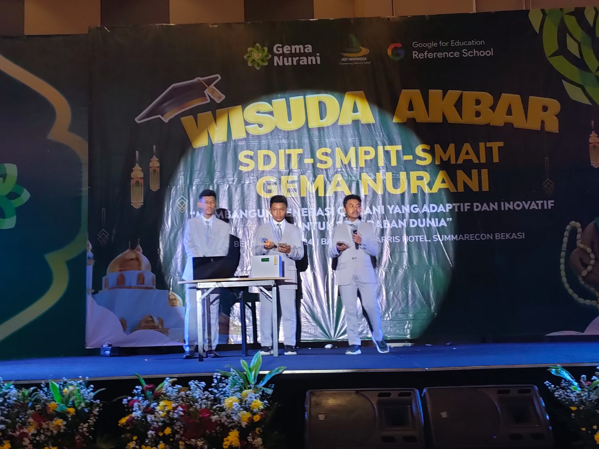

<h1>Simulasi Kotak Amal Pintar V.1</h1>

<h5>Presentasi Penampilan Project Wisuda Akbar SIT Gema Nurani</h5>

Tanggal Pelaksanaan : <b>8 Juni 2024</b>

<h4>Alat Dan Bahan Yang Dibutuhkan :</h4>
<ul>
    <li>1x Mikrocontroller ESP8266 WIFI</li>
    <li>2x Breadboard 830P</li>
    <li>1x Buzzer</li>
    <li>1x LED Red & Green</li>
    <li>Kabel Jumper Female To Male & Male To Male</li>
    <li>LCD I2C 16x2</li>
    <li>Sensor Warna TCS3200</li>
    <li>Powerbank</li>
    <li>Papan Akrikik Secukupnya</li>
</ul>

<h4>Kontributor :</h4>
<ul>
    <li>Ahnaf Samih [ Pemimpin Project & Ide ]</li>
    <li>Muhammad Nashih Picarima</li>
    <li>Desta Ghassani Mahesworo</li>
</ul>
